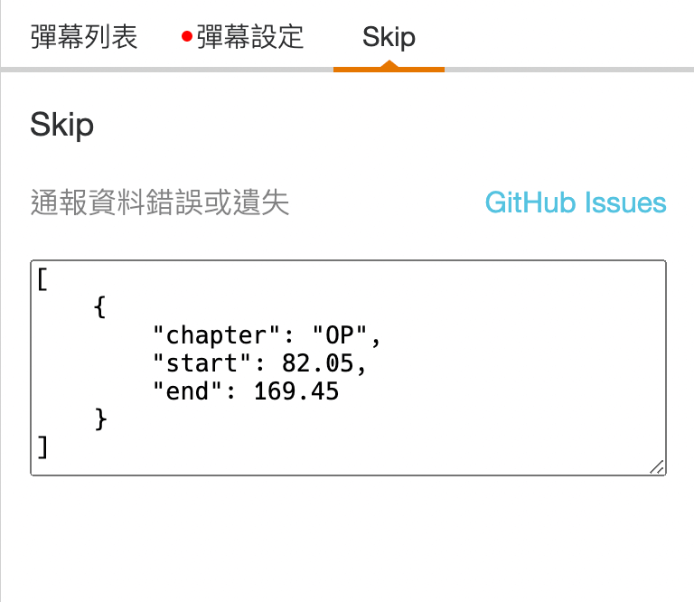

# Baha Anime Skip

Skip OP or other things on Bahamut Anime.

## Database

Database is stored in [`packages/baha-anime-skip-db/data.json`](packages/baha-anime-skip-db/data.json).

Currently, the database includes OP timestamp of **10,000+** episodes. Most of them are automatically detected by programs based on some hypotheses, source code is available in [`helper`](packages/helper) and [`marker`](packages/marker).

**Any PRs or Issues are welcome.**

The schema details are in [`packages/baha-anime-skip-db/README.md`](packages/baha-anime-skip-db/README.md).

## Tampermonkey Script

> Prerequisite: Tampermonkey installed.

Install from [here](https://raw.githubusercontent.com/JacobLinCool/baha-anime-skip/dist/index.user.js).

The button will show up if there is a event record for the current episode and the time is in the event range.

A panel with report link and debug info is also attached. If you click the link, a pre-filled issue will be opened in this repo.

## Submit Issue

You can simply click "GitHub Issues" button in the panel, then add some additional information to the issue body.

https://user-images.githubusercontent.com/28478594/192158622-d82e8527-3523-4469-84e6-691be23e099f.mp4

## Sponsors

Thanks the following generous sponsors for supporting this project.

- [`@limitx0`](https://github.com/limitx0) for 30 days of premium service. 🎉

If you want to sponsor this project, you can send a Bahamut Anime Redeem Code to my email: [`hi@jacoblin.cool`](mailto:hi@jacoblin.cool?subject=%5BSponsor%5D%20Bahamut%20Anime%20Redeem%20Code&body=Code%3A%20......%0D%0A%0D%0AAnything%20you%20want%20to%20tell%20me:%20%0D%0A). And if you want, I will put your name here.

A premium account is useful because it can save my time to wait for the AD when I am testing the program.
